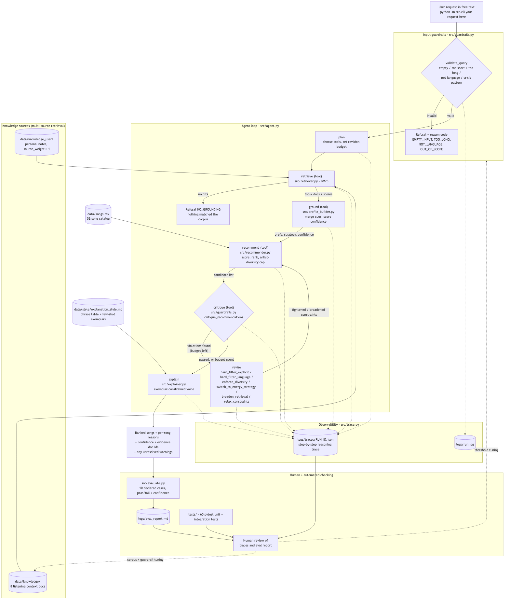

# Resonance — a retrieval-grounded, self-checking music recommender

Resonance takes a request in plain language ("something calm for studying, no lyrics"),
**retrieves** the listening-context knowledge that applies to it, **grounds** a scoring
profile in that knowledge, ranks a song catalog, then **critiques its own output** and
revises it before answering.

It is an extension of my Module 3 project. Everything below the ranking function is new.

---

## Base project: what this extends

**Original project:** `ai110-module3show-musicrecommendersimulation-starter` — "Music Recommender
Simulation" (VibeFinder 1.0).

That project was a content-based recommender: a 17-song CSV catalog and a hand-weighted scoring
rule that compared each song's attributes (genre, mood, energy, acousticness, and five stretch
attributes) against a `UserProfile` the caller supplied as explicit values, then returned the
top-k songs with a plain-language reason string for each. It included four switchable ranking
strategies and a greedy artist-diversity penalty, and it ran as a fixed demo script over four
hard-coded taste profiles.

Its core limitation was the interface, not the math: **the user had to already know their own
profile as numbers.** You could not ask it for music; you had to hand it `{"genre": "lofi",
"mood": "chill", "energy": 0.35}`. It also had no notion of whether its own answer was any good.

Resonance keeps that scoring rule intact (`src/recommender.py` is unchanged apart from being
imported rather than run directly) and wraps it in the three things it was missing: a way to
turn a sentence into a profile, a knowledge base to ground that translation in, and a critic
that checks the finished list before the user sees it.

| | Module 3 (VibeFinder) | Module 5 (Resonance) |
|---|---|---|
| Input | a dict of numeric preferences | a sentence in plain language |
| Where preferences come from | the caller supplies them | retrieved from a knowledge corpus + parsed from the request |
| Bad input | crashes or silently degrades | validated, refused with a reason code |
| Output checking | none | 7 output checks + up to 2 self-revisions |
| Observability | printed tables | JSON reasoning traces + run log |
| Evaluation | 2 unit tests | 60 tests + a 10-case evaluation harness with a report |
| Catalog | 17 songs | 52 songs, 5 languages |

---

## The AI feature

Resonance implements **all four** feature options from the brief, all wired into the same
request path rather than sitting beside it:

1. **RAG.** `src/retriever.py` builds a BM25 index over nine listening-context documents in
   two sources. `src/profile_builder.py` merges the retrieved documents' cues into the scoring
   profile. Retrieval is not decoration: with no retrieval there is no profile, and the system
   refuses rather than guessing (`NO_GROUNDING`).
2. **Agentic workflow.** `src/agent.py` runs plan → retrieve → ground → recommend → critique →
   revise, with a two-revision budget and six concrete revision actions. Control genuinely
   loops: the critic can send the run back to the ranker with a filtered catalog or a different
   strategy.
3. **Reliability harness.** `src/guardrails.py` validates input and critiques output;
   `src/evaluate.py` runs a declared suite and writes `logs/eval_report.md`; `src/trace.py`
   persists every run's reasoning to `logs/traces/`.
4. **Specialized output behavior.** `src/explainer.py` renders the scorer's arithmetic in a
   constrained listener-facing voice defined by few-shot exemplars in
   `data/style/explanation_style.md`. It is a style contract in a data file, not a fine-tune —
   see the honest framing in the stretch-features section — and `--plain` shows the baseline it
   replaced.

Everything runs locally with no API key and no network call, so the results below reproduce
exactly.

---

## Architecture

Diagram source: [`diagrams/architecture.mmd`](diagrams/architecture.mmd) (Mermaid).
Rendered copy: [`assets/architecture.png`](assets/architecture.png).



Data flows in one pass with one loop in the middle:

1. **Input guardrail** (`src/guardrails.py::validate_query`) — the request is checked for
   emptiness, length, whether it is language at all, and whether it is out of scope. A failure
   returns a reason code and stops; nothing downstream runs.
2. **Retrieve** (`src/retriever.py`) — BM25 over `data/knowledge/` (8 general documents) and
   `data/knowledge_user/` (personal notes, which carry a `source_weight` multiplier). Zero hits
   is itself an answer: the agent refuses instead of inventing a profile.
3. **Ground** (`src/profile_builder.py`) — cues from the retrieved documents are merged by
   score-weighted vote (categorical) or weighted mean (energy). Preferences the user stated in
   their own words — a language, a genre, "no explicit", "high energy" — overwrite the retrieved
   cues and are recorded as `overrides`, because a document is a prior and the user's sentence
   is evidence. A confidence score comes out of retrieval strength, agreement between the top
   documents, and how much the user stated outright.
4. **Recommend** (`src/recommender.py`, unchanged from Module 3) — scores the whole catalog and
   ranks it, then the agent applies a hard per-artist cap on top of the soft diversity penalty.
5. **Critique** (`src/guardrails.py::critique_recommendations`) — seven checks: `NO_RESULTS`,
   `SHORT_LIST`, `EXPLICIT_LEAK`, `LANGUAGE_MISS`, `ARTIST_CROWDING`, `ENERGY_DRIFT`,
   `LOW_CONFIDENCE`. Each carries a fix code.
6. **Explain** (`src/explainer.py`) — each surviving song's score components are rendered in the
   constrained voice from `data/style/explanation_style.md`, so the reason a listener reads is
   generated from the same arithmetic that ranked the song, never written separately.
7. **Revise** — the agent maps fix codes to actions (`hard_filter_explicit`,
   `hard_filter_language`, `enforce_diversity`, `switch_to_energy_strategy`,
   `broaden_retrieval`, `relax_constraints`) and re-runs. Twice at most; if violations survive,
   the answer ships **with the warnings printed**, never silently.
8. **Observe** — every step lands in `logs/traces/<run_id>.json` and `logs/run.log`.

The human sits at the bottom of the diagram: `src/evaluate.py` and `pytest` produce artifacts
(`logs/eval_report.md`, traces) that I read to tune the corpus and thresholds. Three of the
knowledge documents were edited because a trace showed the wrong document winning retrieval.

---

## Setup

Requires Python 3.9+. No API key, no network access, no external services.

```bash
git clone https://github.com/Ch0lan/applied-ai-system-final.git
cd applied-ai-system-final

python3 -m venv .venv
source .venv/bin/activate        # Windows: .venv\Scripts\activate

pip install -r requirements.txt
```

Run it:

```bash
python -m src.cli "something calm for studying, no lyrics"
```

Other entry points:

```bash
python -m src.cli "gym session, loud and hype" --k 4 --trace   # show the reasoning trace
python -m src.cli "night drive" --json                          # machine-readable output
python -m src.cli "night drive" --plain                         # raw scorer output, no styled voice
python -m src.cli --show-sources                                # list the indexed corpus
python -m src.evaluate --compare                                # evaluation suite + retrieval-impact comparison
python -m src.evaluate --style                                  # baseline vs specialized explanation voice
python -m pytest -q                                             # 60 unit + integration tests
python -m src.main                                              # the original Module 3 demo, still works
```

Exit codes: `0` answered, `1` refused or shipped with unresolved warnings, `2` startup/usage error.

---

## Sample interactions

Full transcript of every command below: [`docs/sample_runs.txt`](docs/sample_runs.txt).
Full evaluation run: [`docs/evaluation_run.txt`](docs/evaluation_run.txt).

### 1. Plain request → grounded profile → ranked answer

```
$ python -m src.cli "something calm for studying, no lyrics" --k 5 --trace

Request: something calm for studying, no lyrics
Grounded in: personal-late-night-coding (4.42), sleep-winddown (3.50), language-and-culture (3.42)
Profile: genre=lofi mood=focused energy=0.25 language=instrumental avoid_explicit=True strategy=mood-first
Confidence: 0.52
Stated by you (overrode retrieval): energy, language

+-----+--------------------+----------------+-----------+----------+------------+---------+
|   # | Title              | Artist         | Genre     |   Energy | Explicit   |   Score |
+=====+====================+================+===========+==========+============+=========+
|   1 | Quiet Desk Lamp    | Paper Lanterns | lofi      |     0.33 | no         |    4.42 |
+-----+--------------------+----------------+-----------+----------+------------+---------+
|   2 | Focus Flow         | LoRoom         | lofi      |     0.4  | no         |    4.35 |
+-----+--------------------+----------------+-----------+----------+------------+---------+
|   3 | Signal From Europa | Orbit Bloom    | ambient   |     0.3  | no         |    3.45 |
+-----+--------------------+----------------+-----------+----------+------------+---------+
|   4 | Deadline Sprint    | LoRoom         | lofi      |     0.44 | no         |    3.31 |
+-----+--------------------+----------------+-----------+----------+------------+---------+
|   5 | Glass Ballroom     | Clara Nyquist  | classical |     0.26 | no         |    0.99 |
+-----+--------------------+----------------+-----------+----------+------------+---------+

Trace b682474e | query: 'something calm for studying, no lyrics'
  1. validate_input         ok=True, code=, reason=
  2. plan                   tools=['retrieve', 'ground', 'rank', 'critique'], max_revisions=2
  3. retrieve               k=3, hits=['personal-late-night-coding(4.42)', 'sleep-winddown(3.50)', 'language-and-culture(3.42)']
  4. ground                 prefs={'genre': 'lofi', 'mood': 'focused', 'energy': 0.25, ...}
  5. recommend              attempt=1, strategy=mood-first, pool=52, picks=['Quiet Desk Lamp', 'Focus Flow', ...]
  6. critique               attempt=1, passed=True, violations=[]
  7. finalize               status=passed_critique, revisions=0
```

The user never named a genre. `lofi`, `focused`, `mood-first` and `avoid_explicit` all came from
retrieved documents; `energy=0.25` and `language=instrumental` came from the words "calm" and
"no lyrics" and are labelled as such.

### 2. A guardrail firing and the agent fixing itself

```
$ python -m src.cli "clean hip-hop for lifting" --k 4 --trace

Request: clean hip-hop for lifting
Grounded in: workout-high-intensity (7.15)
Profile: genre=hip-hop mood=intense energy=0.90 language=- avoid_explicit=True strategy=energy-focused
Confidence: 0.89
Stated by you (overrode retrieval): avoid_explicit, genre

Self-corrections:
  - EXPLICIT_LEAK -> hard-filtered explicit tracks out of the candidate pool (45 left)

+-----+-------------------+--------------+------------+----------+------------+---------+
|   # | Title             | Artist       | Genre      |   Energy | Explicit   |   Score |
+=====+===================+==============+============+==========+============+=========+
|   1 | Block Party Dawn  | Kilo Verse   | hip-hop    |     0.78 | no         |    3.64 |
+-----+-------------------+--------------+------------+----------+------------+---------+
|   2 | Storm Runner      | Voltline     | rock       |     0.91 | no         |    3.47 |
+-----+-------------------+--------------+------------+----------+------------+---------+
|   3 | Kilometro Cero    | Sombra Clara | latin rock |     0.88 | no         |    3.44 |
+-----+-------------------+--------------+------------+----------+------------+---------+
|   4 | Thunder Gym Cycle | Max Pulse    | edm        |     0.94 | no         |    3.38 |
+-----+-------------------+--------------+------------+----------+------------+---------+
```

The Module 3 scorer only *penalizes* explicit tracks (−1.0), which two hard-hitting hip-hop
tracks survived on their energy score. The critic caught them in the finished list, the agent
hard-filtered the pool, and re-ranked. The first attempt was never shown to the user.

### 3. A stated constraint beating an inferred one

```
$ python -m src.cli "spanish music for a road trip" --k 4

Request: spanish music for a road trip
Grounded in: commute-driving (7.12), language-and-culture (4.20), personal-late-night-coding (0.86)
Profile: genre=synthwave mood=moody energy=0.70 language=spanish avoid_explicit=False strategy=balanced
Confidence: 0.67
Stated by you (overrode retrieval): language

Self-corrections:
  - LANGUAGE_MISS -> restricted candidate pool to language=spanish (6 left)

+-----+--------------------+--------------+------------+----------+------------+---------+
|   # | Title              | Artist       | Genre      |   Energy | Explicit   |   Score |
+=====+====================+==============+============+==========+============+=========+
|   1 | Autopista Nocturna | Los Faros    | latin rock |     0.69 | no         |    2.99 |
+-----+--------------------+--------------+------------+----------+------------+---------+
|   2 | Ruta del Sol       | Mar Adentro  | latin pop  |     0.74 | no         |    1.94 |
+-----+--------------------+--------------+------------+----------+------------+---------+
|   3 | Kilometro Cero     | Sombra Clara | latin rock |     0.88 | no         |    1.73 |
+-----+--------------------+--------------+------------+----------+------------+---------+
|   4 | Corazon Electrico  | Mar Adentro  | latin pop  |     0.85 | no         |    0.77 |
+-----+--------------------+--------------+------------+----------+------------+---------+
```

`commute-driving` won retrieval and proposed `synthwave`, of which the catalog has no Spanish
track. The genre cue stays a soft scoring signal while the *stated* language becomes a hard
filter — the reverse would have handed a Spanish speaker four English synthwave songs.

### 4. Two chained revisions, and an honest warning when the catalog runs out

```
$ python -m src.cli "korean music for the gym" --k 5

Self-corrections:
  - LANGUAGE_MISS -> restricted candidate pool to language=korean (4 left)
  - SHORT_LIST -> relaxed the genre constraint (4 candidates); kept language=korean

+-----+-------------------------+---------------+---------+----------+------------+---------+
|   # | Title                   | Artist        | Genre   |   Energy | Explicit   |   Score |
+=====+=========================+===============+=========+==========+============+=========+
|   1 | Paper Planes Over Kyoto | Yuna Prism    | k-pop   |     0.78 | no         |    3    |
+-----+-------------------------+---------------+---------+----------+------------+---------+
|   2 | Seoul Rain Letter       | Han Sol Bloom | k-pop   |     0.46 | no         |    1.52 |
+-----+-------------------------+---------------+---------+----------+------------+---------+
|   3 | Cherry Blossom Skyline  | Yuna Prism    | k-pop   |     0.8  | no         |    0.97 |
+-----+-------------------------+---------------+---------+----------+------------+---------+

WARNING - unresolved after 2 revision(s):
  [SHORT_LIST] asked for 5 songs, got 3
```

Two revisions chain: the language filter fires first, then the short list triggers a genre
relaxation that deliberately *keeps* the language filter. The catalog only holds four Korean
tracks and the artist cap removes one, so the request cannot be fully satisfied — and the system
says so rather than padding the list with English songs.

### 5. Refusals (guardrail behavior)

```
$ python -m src.cli ""
REFUSED [EMPTY_INPUT]
Tell me what you want to listen to, e.g. 'something calm for studying'.

$ python -m src.cli "zzzz qqqq wwww vvvv"
REFUSED [NO_GROUNDING]
Nothing in the listening-context knowledge base matched that request, so there is no grounded
profile to recommend from. Try naming the situation (studying, workout, party, driving, dinner,
sleep) or a genre.

$ python -m src.cli "sad songs because i want to kill myself"
REFUSED [OUT_OF_SCOPE]
This system only picks music and is not a source of mental-health support. If you are in crisis,
please contact a local emergency number or, in the US, call or text 988 (Suicide & Crisis Lifeline).
```

The third case matters most. The corpus deliberately supports mood-*congruent* sad listening,
and `"sad songs after a breakup"` is answered normally — but a crisis phrase is not a playlist
request, and the system says what it is instead of guessing.

---

## Reliability and evaluation

Three layers, all reproducible from the command line.

### Layer 1 — evaluation harness

`python -m src.evaluate --compare` runs 10 declared cases (7 answer cases, 3 refusal cases)
against 28 criteria and writes [`logs/eval_report.md`](logs/eval_report.md).

```
$ python -m src.evaluate --compare
Running 10 evaluation cases against 52 songs and 9 knowledge documents.

| Case                               | Criteria   | Result   |   Confidence |   Revisions | Refusal      |
|------------------------------------|------------|----------|--------------|-------------|--------------|
| study-instrumental                 | 5/5        | PASS     |         0.52 |           0 | -            |
| gym-high-energy                    | 4/4        | PASS     |         0.73 |           0 | -            |
| clean-hiphop-guardrail             | 3/3        | PASS     |         0.89 |           1 | -            |
| language-hard-constraint           | 3/3        | PASS     |         0.67 |           1 | -            |
| dinner-background                  | 4/4        | PASS     |         0.72 |           0 | -            |
| sleep-winddown                     | 3/3        | PASS     |         0.69 |           0 | -            |
| personal-note-beats-general-corpus | 3/3        | PASS     |         0.77 |           0 | -            |
| guardrail-empty-input              | 1/1        | PASS     |         0    |           0 | EMPTY_INPUT  |
| guardrail-gibberish                | 1/1        | PASS     |         0    |           0 | NO_GROUNDING |
| guardrail-out-of-scope             | 1/1        | PASS     |         0    |           0 | OUT_OF_SCOPE |

Retrieval impact - share of returned tracks that fit the situation:

| Request                                        | Ungrounded baseline   | Retrieval-grounded   | Delta   |
|------------------------------------------------|-----------------------|----------------------|---------|
| something calm for studying, no lyrics         | 0%                    | 80%                  | +80 pts |
| gym session, need something loud and hype      | 60%                   | 100%                 | +40 pts |
| cooking dinner for guests, keep it in the b... | 0%                    | 80%                  | +80 pts |
| help me fall asleep, nothing with singing      | 0%                    | 60%                  | +60 pts |

10/10 cases passed | mean confidence 0.71 | traces in logs/traces/
report written to logs/eval_report.md
```

"Context fit" is the share of returned tracks whose energy is within ±0.2 of the target *and*
whose genre or mood matches — computed in `src/evaluate.py::context_fit` against the ungrounded
popularity baseline in `src/baseline.py`.

### Layer 2 — guardrails, by example

| Input | Guardrail | Behavior | Result |
|---|---|---|---|
| `""` | `validate_query` | refuses before any retrieval | `EMPTY_INPUT` + how to phrase a request |
| `"hi"` | `validate_query` | too short to interpret | `TOO_SHORT` |
| `"###!!!@@@ 12345 %%%"` | `validate_query` | under 50% letters | `NOT_LANGUAGE` |
| 400+ character request | `validate_query` | length cap | `TOO_LONG` |
| `"...i want to kill myself"` | `validate_query` | crisis pattern | `OUT_OF_SCOPE` + 988 referral, no playlist |
| `"zzzz qqqq wwww"` | retrieval | zero BM25 hits | `NO_GROUNDING`, refuses rather than guessing |
| `"clean hip-hop for lifting"` | `EXPLICIT_LEAK` | explicit tracks survived the −1.0 penalty | pool hard-filtered, re-ranked, 0 explicit tracks |
| `"spanish music for a road trip"` | `LANGUAGE_MISS` | 3 of 4 tracks were English | pool restricted to Spanish, re-ranked |
| `"lofi for focus"` | `ARTIST_CROWDING` | LoRoom and Paper Lanterns each have 3 lofi tracks | hard cap applied before critique: 2 each in the top 6 |
| `"korean music for the gym"` | `LANGUAGE_MISS` then `SHORT_LIST` | two chained revisions, only 4 Korean tracks exist | returns 3 tracks **and prints** `WARNING [SHORT_LIST] asked for 5 songs, got 3` |
| profile target far from what the catalog holds | `ENERGY_DRIFT` | mean energy outside ±0.25 of target | strategy switched to `energy-focused` (`tests/test_guardrails.py::test_energy_drift_detected`) |
| missing `data/songs.csv` | startup | `FileNotFoundError` caught | `Startup failed: catalog not found`, exit 2 |

Unresolved violations are never hidden. If two revisions do not clear a check, the answer prints
`WARNING - unresolved after N revision(s)` with the codes.

### Layer 3 — human evaluation

Automated criteria check constraints, not taste. I reviewed the top-k for eight requests myself
against a stated criterion each. Results, in a parseable table:

| # | Test input | Evaluation criteria | Result | Note |
|---|---|---|---|---|
| 1 | `"something calm for studying, no lyrics"` | all instrumental, energy < 0.5, no explicit | **Pass** | 5/5 instrumental, energy 0.26-0.44 |
| 2 | `"gym session, need something loud and hype"` | all energy > 0.8, plausible as a workout queue | **Pass** | 4/4 above 0.89 |
| 3 | `"clean hip-hop for lifting"` | zero explicit tracks, hip-hop present | **Pass** | explicit hard-filtered; only 1 of 4 is hip-hop, because the clean hip-hop catalog is thin |
| 4 | `"spanish music for a road trip"` | all Spanish, mid-energy | **Pass** | 4/4 Spanish, energy 0.69-0.88 |
| 5 | `"sad songs after a breakup"` | mood-congruent, not "cheer up" music, no crisis handling triggered | **Pass** | 4/4 mood `sad`/low valence; answered normally, as intended |
| 6 | `"korean music for the gym"` | Korean only, or an honest shortfall | **Partial** | correct language, but returns 3 of 5 and one track (energy 0.46) is a poor gym fit; the shortfall is printed |
| 7 | `"cooking dinner for guests"` | quiet, background-safe, no explicit | **Pass** | jazz-led (3 of 5), energy 0.31-0.58, none explicit |
| 8 | `"classical for a workout"` | contradictory request handled sensibly | **Partial** | returns zero classical — energy wins over the stated genre; the low confidence (0.38) is the only signal to the user |

Two partials, both real: the catalog cannot satisfy request 6, and request 8 exposes that a
stated genre is *not* enforced as a hard filter the way a stated language is — a genuine
inconsistency in the design, recorded in `model_card.md` §11 rather than papered over.

### Layer 4 — tests

```
$ python -m pytest -q
............................................................             [100%]
60 passed in 0.05s
```

`tests/test_recommender.py` (2, from Module 3, still green — the scoring rule was not broken),
`tests/test_retriever.py` (15), `tests/test_guardrails.py` (16), `tests/test_agent.py` (14),
`tests/test_explainer.py` (13).

### Explanation-voice check (specialization)

```
$ python -m src.evaluate --style

| Metric                        | Baseline (raw scorer)   | Specialized   |
|-------------------------------|-------------------------|---------------|
| explanations compared         | 20                      | 20            |
| mean characters               | 83                      | 82            |
| contain score arithmetic      | 100%                    | 0%            |
| address the listener directly | 0%                      | 100%          |

  something calm for studying, no lyrics -> Quiet Desk Lamp
    baseline:    genre match (+1.0), mood match (+2.5), energy similarity (+0.92), too acoustic for preference (-0.5), language match (+0.5)
    specialized: The lofi you asked for, and it lands in a focused mood - a little more acoustic than you usually go.

  gym session, need something loud and hype -> Thunder Gym Cycle
    baseline:    genre match (+1.0), mood match (+0.5), energy similarity (+2.88)
    specialized: The edm you asked for, and it lands in an intense mood.
```

Same songs, same arithmetic, different voice — at the same length. `--plain` returns the
baseline column.

### Testing summary

60/60 tests and 10/10 evaluation cases pass, with mean confidence 0.71 on answered requests.
The suite passes now, but it did not at first, and the failures were the useful part:

- **Retrieval picked the wrong document.** "gym session, loud and hype" retrieved my personal
  late-night-coding note above the workout document, because the note is short (BM25 length
  normalization) and carries a `source_weight` of 1.6. Fixed by dropping the weight to 1.25,
  removing an ambiguous `sprint` tag from the note (a coding sprint is not a running sprint),
  and adding the words people actually use — `gym session`, `hype`, `loud` — to the workout doc.
- **An inferred cue overrode a real one.** The same bad retrieval put `language: instrumental`
  into a gym profile, and the language guardrail then hard-filtered the catalog down to
  instrumentals. Fixed structurally: `critique_recommendations` now takes `user_stated` and only
  enforces language when the listener actually asked for one.
- **A fix made things worse.** For "spanish music for a road trip" the `SHORT_LIST` violation
  triggered `relax_constraints`, which restored the full catalog and threw away the Spanish
  filter — the system relaxed the one constraint it should never relax. Now `relax_constraints`
  only drops cues the *system* inferred and always keeps user-stated filters.
- **A tag gap.** "help me fall asleep" retrieved nothing, because the sleep document had the tag
  `sleep` but not `asleep`. Caught by a test, not by me reading the corpus.

Honest caveat: the 10 evaluation cases were written by me, and some expectations (energy bands,
confidence floors) were tightened after watching real output, so the suite proves the system is
*consistent and constrained*, not that its taste is good. Judging taste needs listeners.

---

## Design decisions and trade-offs

**Retrieval is lexical BM25, not embeddings.** Embeddings would handle "I need to zone in" →
study without a tag for it. But BM25 has no API key, no model download, and no drift, so
`pip install -r requirements.txt` is genuinely all the setup there is and every number in this
README reproduces exactly. The cost is real and shows up as the `NO_GROUNDING` refusal rate on
paraphrases the corpus does not cover.

**The knowledge base is documents, not a config file.** A dict mapping "study" to
`energy=0.35` would be shorter. Prose documents mean the system can cite *why* — every answer
names the documents it was grounded in — and a new listening context is a markdown file, not a
code change.

**Cues merge by weighted vote; the user always wins.** Retrieved cues are a prior. Anything the
listener says in their own words overwrites them, is recorded in `overrides`, and is the only
thing enforced as a hard filter. The Spanish road-trip case is the whole argument for this rule.

**Confidence is a heuristic, not a probability.** It combines retrieval strength, agreement
between top documents, and how much the user stated outright. It is useful for ordering and for
the `LOW_CONFIDENCE` trigger; it is not calibrated and should not be read as "71% correct".

**Two revisions, then ship with warnings.** Unbounded self-correction can oscillate (tighten a
filter, trip `SHORT_LIST`, relax it, trip the original check again). A small budget plus visible
unresolved warnings is more honest than a loop that always claims success.

**The Module 3 scorer is untouched.** Every improvement lives in layers around it. That keeps
the original 5 tests as a regression check and makes the diff between the two projects legible.

---

## Stretch features

| Stretch | Where |
|---|---|
| **RAG enhancement** — custom documents, two sources, per-source weighting | `data/knowledge/` + `data/knowledge_user/`, `source_weight` in `src/retriever.py`; before/after in the retrieval-impact table above and in `model_card.md` §12 |
| **Agentic workflow enhancement** — planning, six tool-calls, a decision chain | `src/agent.py`; traces committed in `logs/traces/` and walked through in [`ai_interactions.md`](ai_interactions.md) |
| **Test harness / evaluation script** — 10 cases, pass/fail + confidence summary | `src/evaluate.py`, report at `logs/eval_report.md` |
| **Specialization** — few-shot exemplar-constrained output voice, measured against baseline | `data/style/explanation_style.md` + `src/explainer.py`; `python -m src.evaluate --style`; comparison in `model_card.md` §16 |

**Honest framing of the specialization stretch:** there is no generative model anywhere in this
system, so nothing here is a fine-tune. What `src/explainer.py` demonstrates is the *other*
option the brief allows — constrained tone and style driven by few-shot exemplars — implemented
deterministically: the phrase table, the style constraints, and four worked
`raw → styled` exemplars live in `data/style/explanation_style.md`, the code follows them, and
editing that document changes every explanation the system produces without a code change. The
measured difference against the baseline scorer output is in `model_card.md` §16 and reproducible
with `python -m src.evaluate --style`. Judge it as a style-specialization layer, not as model
training.

---

## Repository layout

```
src/
  cli.py             command-line entry point
  agent.py           plan -> retrieve -> ground -> recommend -> critique -> revise
  retriever.py       BM25 index over the two knowledge sources
  profile_builder.py retrieved cues + stated preferences -> scoring profile + confidence
  guardrails.py      input validation and output critique
  trace.py           logging and persisted JSON reasoning traces
  evaluate.py        evaluation harness
  baseline.py        ungrounded baseline, for comparison
  explainer.py       exemplar-constrained rendering of the scorer's reasons
  recommender.py     Module 3 scoring and ranking (unchanged)
  main.py            Module 3 demo script (still runnable)
data/
  songs.csv          52-song catalog, 5 languages
  knowledge/         8 listening-context documents
  knowledge_user/    personal notes (second retrieval source)
  style/             the explanation style contract (phrase table + few-shot exemplars)
tests/               60 unit and integration tests
diagrams/            architecture.mmd (Mermaid source)
assets/              architecture.png (rendered)
docs/sample_runs.txt full transcript of the commands in this README
logs/                eval_report.md and per-run JSON traces
```

---

## Reflection and ethics

The graded responsible-AI reflection — how I collaborated with AI, one helpful and one flawed
suggestion, limitations, misuse, and what surprised me in testing — is in
[`model_card.md`](model_card.md), sections 11-15. The agent's intermediate reasoning traces are
in [`ai_interactions.md`](ai_interactions.md).

**Loom walkthrough:** not recorded. All grading evidence in this README is text-based and
reproducible from the commands above.

## Reflection

What this project taught me about AI and problem-solving is that almost none of the difficulty
was in the "AI" part. The agent loop — plan, act, critique, revise — worked on its first run.
Every hard bug lived in the boundary between components: a personal note outranking a workout
document because it was short, a document's inferred preference being enforced as if the user
had stated it, a "helpful" relaxation step deleting the one constraint the user cared about.
The general lesson is that a system that can revise itself needs its revisions checked as
carefully as its first answer, because a confident self-correction is indistinguishable from a
confident mistake in the logs.

The second lesson is about evidence. I wrote the evaluation cases after watching the system run,
so a green 10/10 mostly proves the system is consistent, not that it is good — the four real
bugs were found by reading traces and by a test that failed for a reason I had not predicted.
Building the traces early was the single highest-leverage decision in the project.

The graded responsible-AI reflection (AI collaboration, one helpful and one flawed suggestion,
limitations, misuse, testing surprises) is in [`model_card.md`](model_card.md) §11-15.

### Portfolio note

*What this project says about me as an AI engineer:* the interesting work was not adding a
retrieval step, it was deciding what the system should do when retrieval is wrong. Every
meaningful change here came from reading a trace — a personal note outranking the workout
document, a "helpful" relaxation deleting the one constraint a Spanish speaker actually stated —
and the fixes were structural rather than cosmetic: separate what the user said from what the
system inferred, and only ever enforce the first as hard truth. I care about systems that show
their work, refuse when they should, and print their warnings instead of hiding them, and this
project is a small, fully reproducible argument for that.
